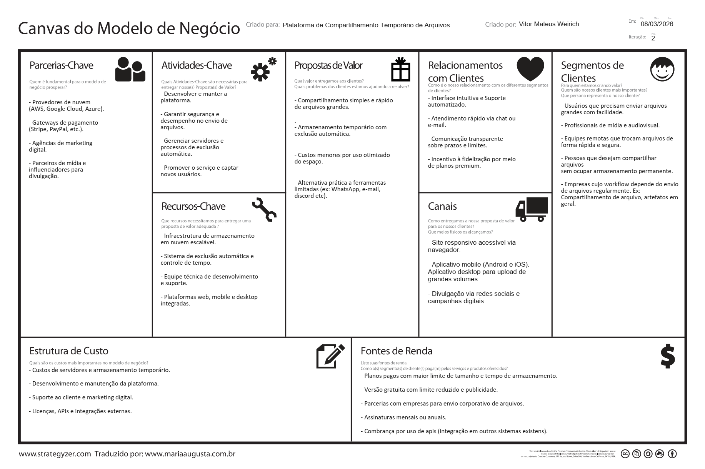

# Projeto Integrador

- Aluno(a): Vitor Mateus Weirich (weirichvitor@gmail.com)
- Código: 369881
- Turma: EAD54-12
- Professor(a): Alysson Borges
- Disciplina: 30062 - PROJETO INTEGRADOR - EAD54-12

Este repositório contém o desenvolvimento completo de uma **plataforma de compartilhamento temporário de arquivos**, criada como Projeto Integrador do curso de Análise e Desenvolvimento de Sistemas.

O projeto abrange todas as etapas do desenvolvimento de um sistema, incluindo levantamento de requisitos, modelagem do negócio, documentação técnica e implementação da aplicação.

A solução é composta por um frontend web responsivo desenvolvido em Vue.js, um aplicativo mobile desenvolvido com React Native (Expo) e uma API backend em Spring Boot, utilizando PostgreSQL como banco de dados. Para o armazenamento de arquivos será utilizado um object storage compatível com a API S3 (como Amazon S3, Cloudflare R2 ou MinIO).

Além do código-fonte, o repositório também inclui documentação do projeto e diagramas de modelagem, como diagramas UML e diagramas de banco de dados, que descrevem a arquitetura e o funcionamento do sistema.

## FileShare

Projeto academico para planejar e construir uma plataforma de upload, listagem e compartilhamento de arquivos com acesso autenticado.

## Documentacao Organizada

### Requisitos e decisões de plataforma e tecnologias

Descricao breve: documento com escopo funcional e nao funcional do sistema, juntamente das plataformas e tecnologias escolhidas.

- [Requisitos do sistema](./docs/requisitos/requisitos.md)

### Prototipo (APP Mobile)

Descricao breve: wireframes e fluxo visual simplificado das telas principais do aplicativo.

- [Prototipo de layout mobile](./docs/prototipo-layout-mobile-simplificado/prototipo-layout-mobile.md)

### Canvas do modelo de negócio

### Diagramas

Descricao breve: Centralizacao dos diagramas projeto.

- [Ver README de diagramas](./docs/diagramas/README.md)

### Demonstrações

### App mobile

Link para apresentação do projeto no [YouTube](https://www.youtube.com/watch?v=enwT61He6Dw)

> OBS: Essa apresentação trata-se do projeto base, onde a funcionalidade de upload estava restrita a vídeos, porém todos os conceitos apresentados se mantém

### Site

TODO

### Backend

TODO
