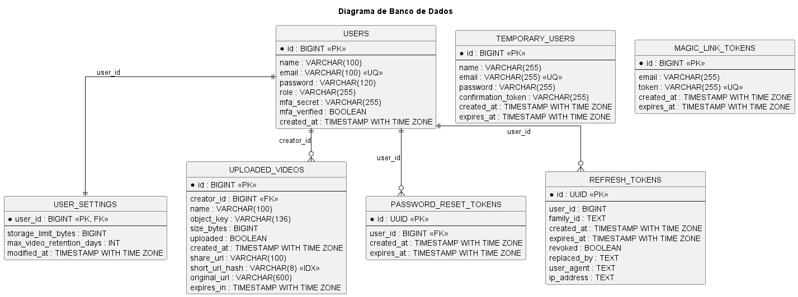
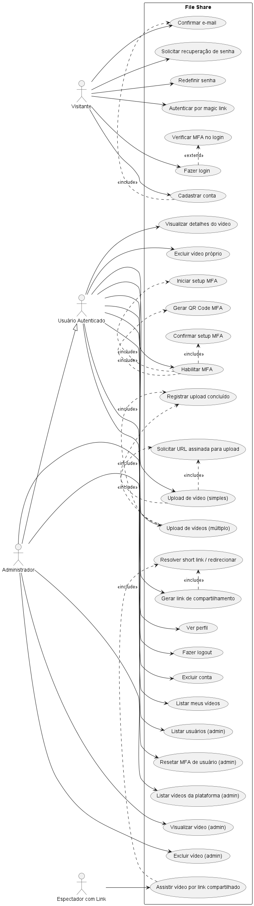
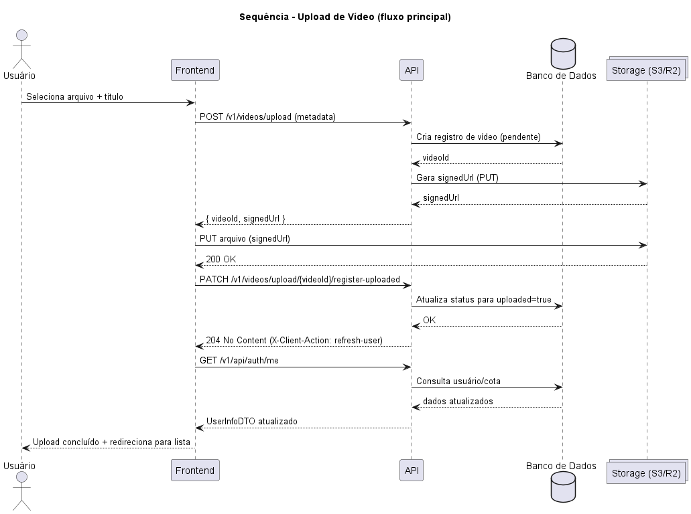
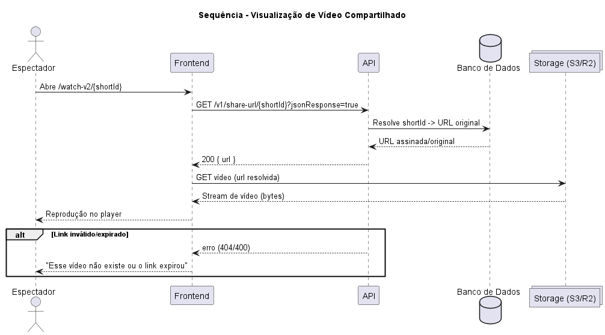
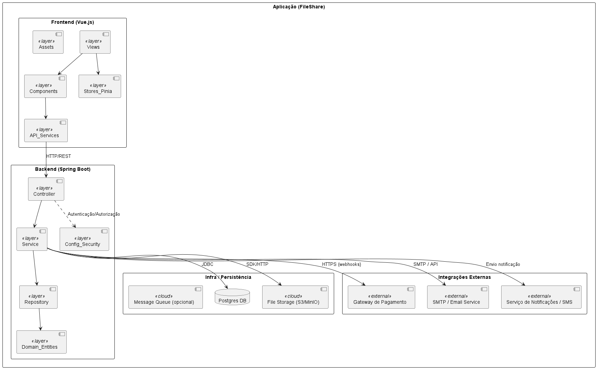
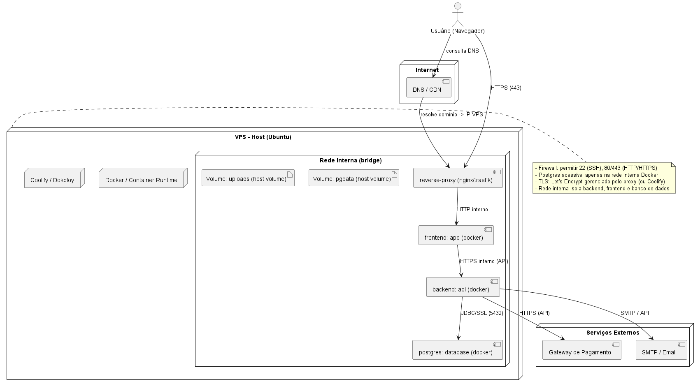
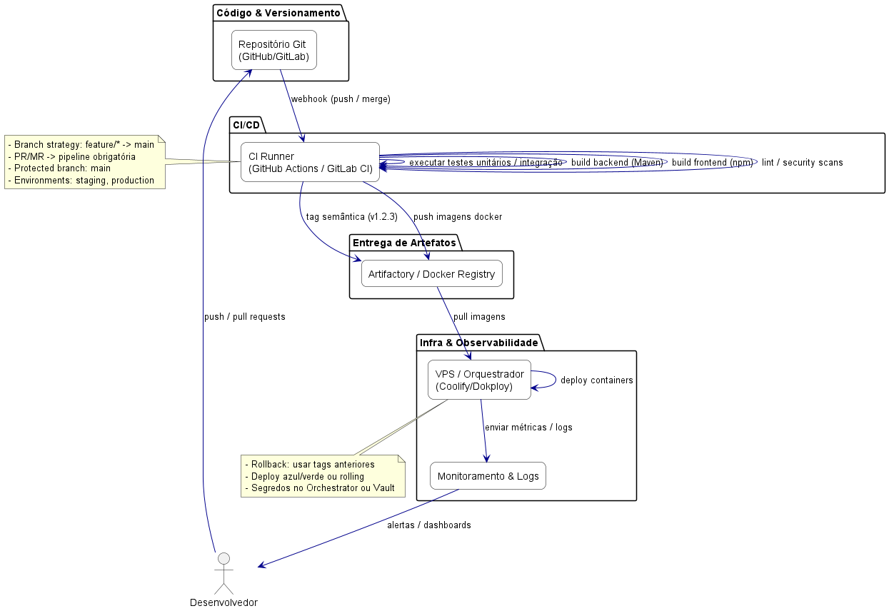

# Diagramas do Projeto

Este documento centraliza os diagramas em formato PNG.

## Caso de Uso

### Diagrama do Banco de Dados

### Diagrama de Caso de Uso

## Diagramas de Sequencia

### Sequencia - Upload de Arquivo

### Sequencia - Visualizacao de Arquivo

## Diagramas de Arquitetura

### Diagrama de Pacotes (Arquitetura da Aplicacao)

### Diagrama de Implantacao (Deployment)

### Arquitetura DevOps (CI/CD)

