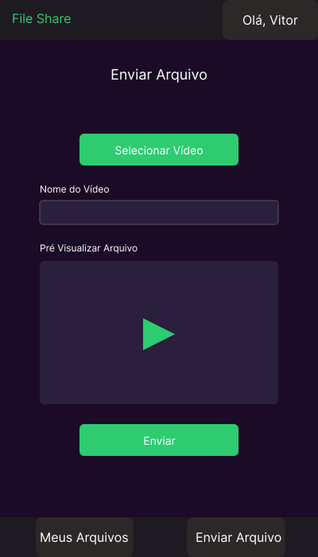

# Projeto Aplicativo Mobile: FileShare

**Disclaimer**:

> **Os protótipos estão simplificados, servindo apenas para ter uma ideia da concepção do APP, mas não englobam todas as fucionalidades (a título de exemplos, só existem telas para quando o compartilhamento for um vídeo).**

## 1. Protótipo: Wireframes/Mockups

A seguir, os mockups que ilustram a interface e as principais funcionalidades do **FileShare**.

### 1.1. Tela de Login

Permite que os usuários existentes acessem suas contas.  

### 1.2. Tela de Cadastro

Tela de registro de novos usuários.  

### 1.3. Tela de Listagem de Arquivos (Meus Arquivos)

Exibe a lista de arquivos enviados pelo usuário.  

### 1.4. Tela de Envio de Arquivo

Permite selecionar e enviar um novo arquivo para a plataforma.  

### 1.4.1 Tela de Envio de arquivo sem pré-visualização

### 1.5. Tela de Visualização de Arquivo

Apresenta os detalhes de um arquivo selecionado e permite sua reprodução.  

## 2. Todas as telas juntas

