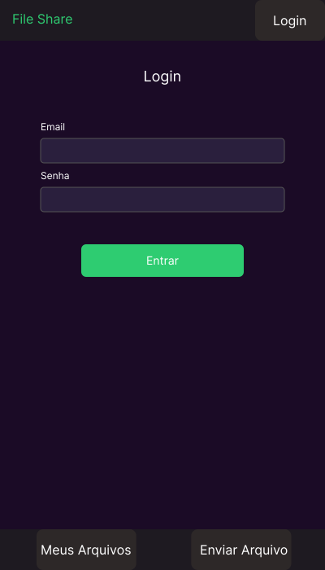
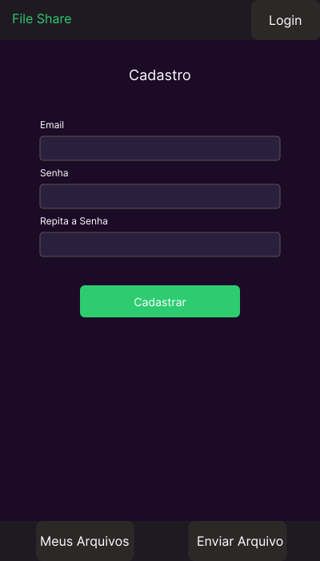
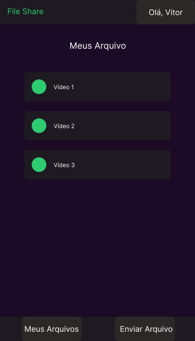
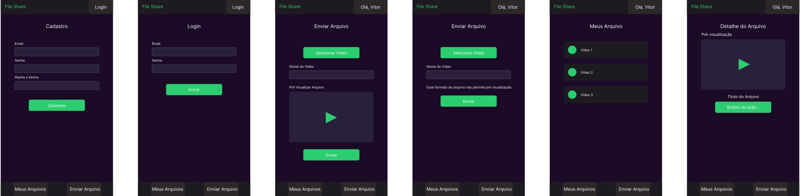

# Projeto Aplicativo Mobile: FileShare

**Disclaimer**:

> **Tanto os requisitos, com os protótipos estão simplificados, servindo apenas para ter uma ideia da concepção do APP, mas não englobam todas as fucionalidades (a título de exemplos, só existem telas para quando o compartilhamento for um vídeo).**

## 1. Requisitos do Aplicativo

### 1.1. Requisitos Funcionais

- **Autenticação de Usuário:**
  - **Login:** Permitir que usuários existentes façam login com e-mail e senha.
  - **Cadastro:** Permitir que novos usuários se cadastrem fornecendo e-mail e senha (com confirmação de senha).

- **Gerenciamento de Arquivos:**
  - **Listagem de Arquivos:** Exibir uma lista dos Arquivos do usuário (Meus Arquivos).
  - **Visualização de Arquivos:** Permitir a visualização de um arquivo selecionado, exibindo título e visualização se existir (nem todos os tipos de arquivos terão como serem visualizados).
  - **Envio de Arquivo:** Permitir que o usuário selecione um arquivo do dispositivo, forneça um título e o envie para a plataforma.

### 1.2. Requisitos Não Funcionais

- **Usabilidade:** A interface deve ser intuitiva e fácil de usar.
- **Desempenho:** O aplicativo deve ser responsivo e carregar informações rapidamente.
- **Segurança:** Credenciais e dados dos usuários devem ser protegidos.
- **Compatibilidade:** O aplicativo deve ser compatível com iOS e Android.

## 2.Escolha da Plataforma de Desenvolvimento: React Native

Para o desenvolvimento do **FileShare**, escolhemos a plataforma **React Native**. As principais justificativas são:

- **Desenvolvimento Multiplataforma:** Permite criar aplicativos para iOS e Android a partir de uma única base de código, reduzindo tempo e custos de desenvolvimento. Como o objetivo é atingir o maior número de usuários, essa é a melhor escolha.
- **Familiaridade com JavaScript/TypeScript:** A equipe (no caso, eu) já possui experiência com essas linguagens, diminuindo a curva de aprendizado.
- **Desempenho Próximo ao Nativo:** Embora seja uma estrutura híbrida, o React Native utiliza componentes nativos. Apesar de não alcançar a performance de um desenvolvimento totalmente nativo, considerando a falta de experiência em iOS e Android nativos, essa abordagem tende a resultar em um desempenho melhor no projeto.
- **Ecossistema Rico e Comunidade Ativa:** A vasta quantidade de bibliotecas e a comunidade ativa facilitam o desenvolvimento e a resolução de problemas.
- **Componentização:** A arquitetura baseada em componentes favorece modularidade, reuso de código e manutenção mais simples, além de facilitar a evolução do aplicativo.

## 3. Protótipo: Wireframes/Mockups

A seguir, os mockups que ilustram a interface e as principais funcionalidades do **FileShare**.

### 3.1. Tela de Login

Permite que os usuários existentes acessem suas contas.  

### 3.2. Tela de Cadastro

Tela de registro de novos usuários.  

### 3.3. Tela de Listagem de Arquivos (Meus Arquivos)

Exibe a lista de arquivos enviados pelo usuário.  

### 3.4. Tela de Envio de Arquivo

Permite selecionar e enviar um novo arquivo para a plataforma.  

### 3.4.1 Tela de Envio de arquivo sem pré-visualização

### 3.5. Tela de Visualização de Arquivo

Apresenta os detalhes de um arquivo selecionado e permite sua reprodução.  

## 4. Todas as telas juntas

